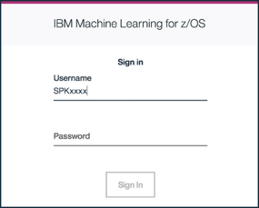
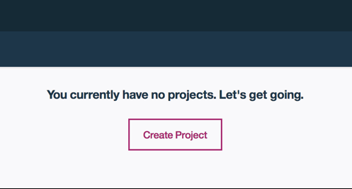
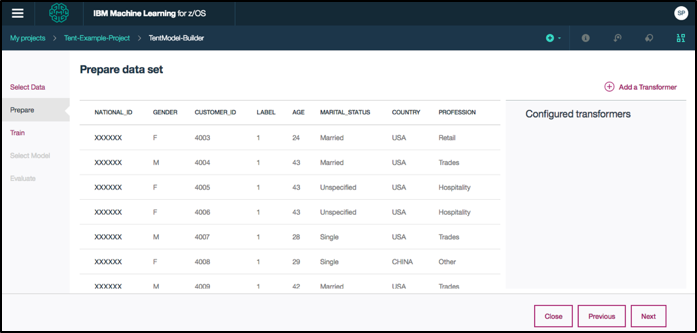

# Running Machine Learning for z/OS

## Overview
The following instructions can be used to run an analytics application using Machine Learning for z/OS. This analytics example uses the Visual Model Builder to build, evaluate, and deploy a model in a retail scenario.  Fictitious customer data stored in a DB2 table are also analyzed with machine learning models using Jupyter Notebook.

## Architecture
To be added

## Steps
1. Sign up for an IBM Z Community Cloud account.
2. Log in to the Self Service Portal.
3. Use case #1: Visual Model Builder.
4. Use case #2: Work with Jupyter Notebook.

## Step 1. Sign up for an IBM Z Community Cloud account

1. If you have not done so already, go to [IBM z Systems Trial Program](http://www-03.ibm.com/systems/z/resources/trials.html) and register for a 30-day trial account. 
2. Select the **Analytics Service on z/OS** trial. 
3. Fill out and submit the registration form.
4. You will receive an email containing credentials to access the self-service portal. This is where you can start exploring all our available services.

## Step 2. Log in to the Self Service Portal

This application demonstrates the creation of an analytic model using the Visual Model Builder feature.  We will do this using the Machine Learning for z/OS graphical user interface. 
Note: The Google Chrome browser is recommended.

1. Open a web browser and access the [IBM Z Community Cloud self-service portal](https://zcloud.marist.edu/#/login). 
   
   

    1. Enter your Portal User ID and Portal Password
    2. Click **'Sign In'**
       
2. You will see the home page for the IBM Z Community Cloud self-service portal.  

    1. Click **'Try Machine Learning'**
    
   
 
3. You will now see a dashboard, which shows the status of your Machine Learning for z/OS instance. 

   At the top of the screen, notice the ‘z/OS Status’ indicator, which should show the status of your instance as ‘OK’.
   
   
   
   In the middle of the screen, your ‘Host’, ‘Machine Learning User Name’, ‘Data Management’, ‘Data connection information’, and ‘Machine Learning Portal’ sections will be displayed. You will use this information in the following examples.  Note: ‘Machine Learning User Name’ is not the same as your ‘Portal User ID’.
   
   

3. For logging in the first time, you must set a new instance password.
    
    1. Click ‘Change Password’ in the ‘Machine Learning User Name’ section
    2. Enter a new password for your instance (Note: this password is not the same as your ‘Portal Password’)
    3. Repeat the new password for your instance
    4. Click ‘Change Password’
 
   
   
## Step 3: Visual Model Builder

In this example, a retail company wants to boost sales of outdoor activities related products.  You will use Visual Model Builder to create a classification model using historical data that resides in DB2 for z/OS.  This model is then used to predict the probability of a customer buying a tent based on the customer’s profile. 

1. Start building a logistic regression model.
   
    1. Click ‘Go’ to access the Machine Learning for z/OS portal
    
    
    
    2. Enter your ‘Machine Learning User Name’ as provided in your dashboard
    
    3. Enter the Password you created in Step 2
    
    4. Click ‘Sign In’
    
    

2. Create a new project.

    1. Locate 'My Projects' from the sidebar menu
    
     
    
    2.  Click ‘Create Project’

     

    3. Enter Tent-Example-Project as the name for the project
    
    
    
    4. Click ‘Create’

    The ‘Analytics assets’ tab will open for the new project.

3. Create a connection to DB2 for z/OS.

    1. Click the ‘Connections’ tab

    
    
    2. Click ‘Add Connections’

    3. Click ‘Create Connection’
    
    

    4. Enter TENTDATA as the name for the connection
    
    5. Select ‘DB2 for z/OS’ as the ‘External service’ and enter the connection details (Host = IP Addr, Port = 5035, Location = DALLASB, Table = MLZ.TENTDATA, User = Machine Learning User Name, and Password) as provided in your dashboard

    
    
    6. Click ‘Create’
    
    7. Click ‘Add Models’ in the ‘Visual model builder’ section
    
4. Enter TentModel-Builder as the name for the model.

   

    1. Click ‘Create’
    
    2. On the ‘Select data asset’ page, select the connection to the TENTDATA table that you created.

    
    
    3. Click ‘Next’

    The following message will appear while the data is loaded.
    
    
    
    4. Click ‘Add a Transformer’ on the ‘Prepare data set’ page
    
    

    5. Select ‘StringIndexer’
    
    
    
    6. Click ‘Configure’

    Keep the default name Transformer1, specify GENDER as input, and specify GENDER_I as output. 
    
    
    
    7. Click ‘Save’
    
    Transformer 1 is added to the Configured Transformers list. 
    
5. Repeat the above steps for adding a transformer to create the following additional transformers: 

    + Transformer2 uses StringIndexer for MARITAL_STATUS as input and MARITAL_STATUS_I as output.
    + Transformer3 uses StringIndexer for PROFESSION as input and PROFESSION_I as output.
    + Transformer4 uses VectorAssembler to assemble the input columns [PROFESSION_I, MARITAL_STATUS_I, GENDER_I, AGE] and features as output.
    
    1. Click ‘Next’ on the ‘Prepare data set’ page
    
    2. Select LABEL from the pull down menu on the ‘Train model’ page
    
    
    
    3. Click ‘Add an Estimator’ and select the ‘Logistic_regression’ algorithm
    
    
    
    4. Click ‘Configure’
    
    
    
    5. Enter TentModelVB for the model name
    
    6. Select features for the Features col 
    
    7. Click ‘Save’
    
6. Start training the model.

    1. Click ‘Next’
    
    
    
7. After the training completes, review the result.

   
   
8. Start evaluating the model. 

    1. Click ‘Next’
    
    
    
9. After the evaluation completes, review the result.

   

    1. Click ‘Save’
    
    
    
    2. Click ‘Save’
    
    
    
    3. Click ‘Close’
    
10. Now, we can deploy the model.

    1. Locate the TentModelVB model from the ‘Model management’ page located on the sidebar menu
    
    
    
    2. Click on the ’. . .’ under ‘ACTIONS’ for the TentModelVB model
    
    3. Click ‘Create deployment’
    
    
    
    4. Enter a name for the deployment, such as tentModelVBDeploy
    
    
    
    5. Click ‘Create’ 
    
    6. Locate tentModelVBDeploy from the ‘Deployments’ tab
    
    
    
    7. Click on tentModelVBDeploy

    In the ‘Deployment Details’ section, the ‘Scoring endpoint’ is a RESTful API provided by the scoring service of Machine Learning for z/OS, which can be called for online scoring within an application.
    
    
    
11. Use the model to test a prediction.

    1. Locate tentModelVBDeploy from the ‘Deployments’ tab
    
    
    
    2. Click on the ’. . .’ under ‘ACTIONS’ for tentModelVBDeploy
    
    3. Click ‘Test’
    
    
    
    4. On the ‘Test model’ page, enter the following values for a record in the ‘Input Record’ field:
    
    **{"Record": ["M",27,"Single","Trades",4000,"USA","XXX"]}**

    
    
    5. Click ‘Predict’
    
    The output should indicate “prediction”: 1, which indicates this customer will purchase a tent based on the inputs to the logistic regression model.  
    
    
    
    6. On the ‘Test model’ page, enter the following values for a record in the ‘Input Record’ field:
    
    **{"Record": ["F",66,"Married","Other",4001,"CHINA","XXX"]}**

    7. Click ‘Predict’
    
    The output should indicate “prediction”: 0, which indicates this customer will not purchase a tent based on the inputs to the logistic regression model.  

## Step 4: Working with Jupyter Notebook

In this section, you will use the Jupyter Notebook tool that is provided with Machine Learning for z/OS. This tool allows you to write and submit Scala code to Spark on z/OS, and view the output within a web GUI.

1. From the sidebar menu, 

    1. select Tent-Example-Project under ‘Recent items’

2. In the Notebooks section of the ‘Analytics assets’ tab, 

    1. Click ‘Add Notebooks’
    
    

3. Enter a name for the notebook, such as Tent-Notebook

    1. Click ‘Create notebook’
    
    

    The notebook is saved and opens in the Notebooks editor.
    
4. Verify that the master address of your Spark installation is returned correctly. 

    1. Type sc.master in the first Notebook cell
    
    
    
    2. Select the cell and Click ‘Cell’ -> ‘Run Cells’
    
    

    This will return the Host IP Address of your Spark installation. For example,
    
    

5. Insert a second cell.
    
    1. Click ‘Insert’ then ‘Insert Cell Below’
    
    

6. In the second cell,

    1. Enter the following sample Scala code.

    ```
    import org.apache.spark.ml.feature.{StringIndexer, IndexToString, VectorIndexer, VectorAssembler} 
    import org.apache.spark.ml.regression.LinearRegression 
    import org.apache.spark.ml.classification.LogisticRegression 
    import com.ibm.analytics.ngp.ingest.Sampling 
    import com.ibm.analytics.ngp.pipeline._ 
    import org.apache.spark.ml.PipelineStage 
    import com.ibm.analytics.ngp.util._
    import org.apache.spark.ml.classification.DecisionTreeClassifier
    import org.apache.spark.ml.evaluation.BinaryClassificationEvaluator
    import com.ibm.analytics.{Learner, Target}
    import com.ibm.analytics.cads.CADSEstimator
    ```
    2. Select the cell and click ‘Cell’ -> ‘Run Cells’
    
    This will import the Spark and Machine Learning packages.
    
7. Insert a third cell 

    1. Enter the following sample Scala code.
    ```
    val dfRaw = spark.read.format("jdbc").options(Map(
        "driver" -> "com.ibm.db2.jcc.DB2Driver",
        "url" -> "jdbc:db2://<url>:<port>/<location>", "user" -> "<userid>", 
        "password" -> "<password>", "dbtable" -> "MLZ.TENTDATA")).load()

    val df = dfRaw.select("label", "GENDER", "AGE", "MARITAL_STATUS", "PROFESSION", "CUSTOMER_ID", "COUNTRY", "NATIONAL_ID")
    val train = 80
    val test = 20

    val splits = Sampling.trainingSplit(df, train, test)

    val trainDF = splits._1
    val testDF = splits._2

    trainDF.cache()
    println(trainDF.show(5))
    ```
    2. Replace <*url*>, <*port*>, <*location*>, <*userid*>, and <*password*> with your information from Step 2 - Part 3 and Part 4
  
      For example,

      ```
      "url" -> "jdbc:db2://123.456.78.901:5035/DALLASB", "user" -> "SPKXXXX", 
      "password" -> "password", "dbtable" -> "MLZ.TENTDATA")).load()
      ```
      
    3. Select the cell and Click ‘Cell’ -> ‘Run Cells’
    
    This will read data from the MLZ.TENTDATA table that you previously created and loaded in your DB2 for z/OS subsystem, split the data into groups for training and testing, and list the first five rows from the training group as a preview. For example,
    
    
 
8.	Insert a fourth cell.

    1. Enter the following sample Scala code.
    ```    
    val genderIndexer = new StringIndexer().setInputCol("GENDER").setOutputCol("GENDER_INDEX")
    val maritalStatusIndexer = new StringIndexer().setInputCol(
        "MARITAL_STATUS").setOutputCol("MARITAL_STATUS_INDEX")
    val professionIndexer: StringIndexer = new StringIndexer().
        setInputCol("PROFESSION").setOutputCol("PROFESSION_INDEX")
    val assembler = new VectorAssembler().setInputCols(Array(
        "GENDER_INDEX", "MARITAL_STATUS_INDEX", "PROFESSION_INDEX", "AGE")).setOutputCol("features")
    val lr = new LogisticRegression().setRegParam(0.01).setLabelCol("label").setFeaturesCol("features")
    val decisionTree = new DecisionTreeClassifier().setMaxBins(50).setLabelCol("label").setFeaturesCol("features")

    val learners = List(Learner("LR", lr), Learner("DT", decisionTree))
    val cads = CADSEstimator().setEvaluator(new     BinaryClassificationEvaluator().setMetricName("areaUnderROC")).setLearners(learners).setKeepBestNLearnersParam(3).setTarget(Target("rawPrediction", "label")).setNumSampleFoldsParam(2)
    val pipeline = new IBMSparkPipeline().setStages(Array(genderIndexer, maritalStatusIndexer, professionIndexer, assembler, cads))
    val model = pipeline.fit(trainDF)
    print(model)
    ```
    2. Ensure all ‘val’ statements do not wrap.
    
    
    
    3. Select the cell and Click ‘Cell’ -> ‘Run Cells’
    
    This will transform the data, construct the feature vectors, train a model using logistic regression, train a model using decision tree, and run CADS to determine the best model.  For example,
    
    

9. Insert a fifth cell.

    1. Enter the following sample Scala code.

    ```
    import com.ibm.analytics.ngp.pipeline.evaluate._
    import com.ibm.analytics.ngp.pipeline.evaluate.JsonMetricsModel._
    import spray.json._
    val metrics = Evaluator.evaluateModel(MLProblemType.BinaryClassifier,model,testDF) 
    println(s"Binary Metric: ${metrics.asInstanceOf[BinaryClassificationMetricsModel].toJson}")
    ```

    2. Select the cell and Click ‘Cell’ -> ‘Run Cells’

    This will evaluate the performance of the model.  For example, the "areaUnderROC" should be similar to 0.7549452221545951.
    
    

10. Insert a sixth cell.

    1. Enter the following sample Scala code.

    ```
    val rocCurve = metrics.asInstanceOf[BinaryClassificationMetricsModel].roc.map{ case ThresholdMetricModel(x, y) => (x,y)}
    val rocDF = spark.createDataFrame(rocCurve).withColumnRenamed("_1", "FPR").withColumnRenamed("_2", "TPR")
    ```

    2. Select the cell and Click ‘Cell’ -> ‘Run Cells’
    
    This will construct the data to plot the ROC curve. 
    
11. Insert a seventh cell.

    1. Enter the following sample Scala code.
    
    ```
    %AddJar -magic file:///u/ibmuser/mlzos/ml/iml-library/brunel/spark-kernel-brunel-all-2.3.jar
    ```

    2. Select the cell and Click ‘Cell’ -> ‘Run Cells’
    
    This will import the Brunel visualization capabilities by adding a jar file to your Notebook. 
    
12. Insert an eighth cell.

    1. Enter the following sample Scala code.

    ```
    %%brunel data('rocDF') x(FPR) y(TPR) line tooltip(#all) axes(x:'False Positive Rate':grid, y:'True Positive Rate':grid) title('ROC')
    ```
    
    2. Select the cell and Click ‘Cell’ -> ‘Run Cells’
    
    This will create a ROC curve that illustrates the relationship between the True Positive Rate (TPR) and the False Positive Rate (FPR).  For example,
    
    

13. Insert a ninth cell.

    1. Enter the following sample Scala code.
    
    ```
    %%brunel data('trainDF') bubble size(#count) color(label) label(marital_status)
    ```
    
    2. Select the cell and Click ‘Cell’ -> ‘Run Cells’
    
    This will create a bubble diagram that illustrates the relationship between marital status and the decision to buy a tent in the sample TENTDATA table data. For example,
    
    

14. Save the Notebook.

    1. Click ‘File’ -> ‘Save’
    
    

15. Stop the Kernel.

    1. From the sidebar menu, select Tent-Example-Project under ‘Recent items’
    
    2. Click on the ’. . .’ under ‘ACTIONS’
    
    3. Click ‘Stop Kernel’
    
    

## Reference
### Links
[IBM Z Community Cloud self-service portal](https://zcloud.marist.edu/#/login)

[IBM Machine Learning for z/OS](https://www.ibm.com/us-en/marketplace/machine-learning-for-zos)

[IBM Knowledge Center](http://leto.svl.ibm.com/kc/SS9PF4_1.1.0/v1r1m0/src/tpc/mlz_createmodelbuilder.dita)

[Jupyter Notebook](http://jupyter-notebook.readthedocs.io/en/latest/)


